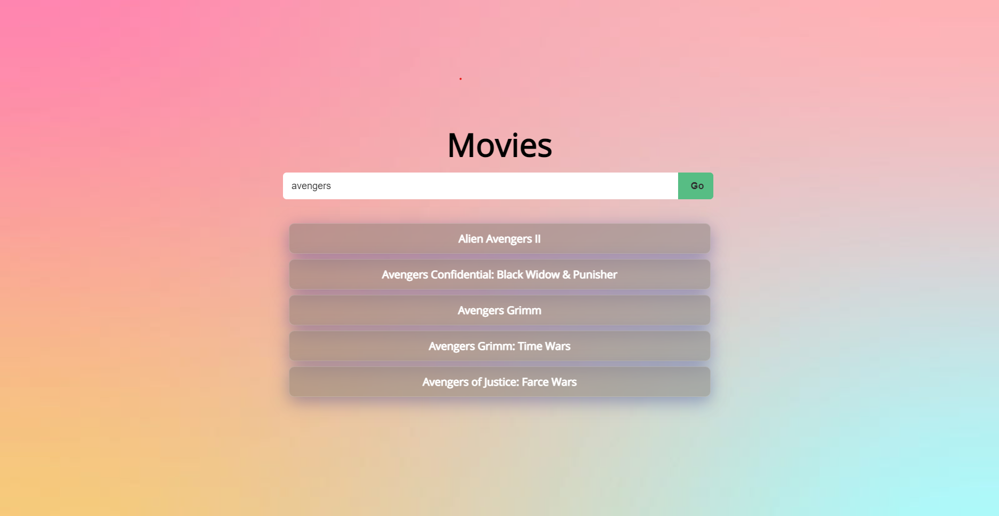

Search Engine for Movies
========

This is a project built to search and find details about movie of any genre. It takes a search token and makes API calls to Movies/TVShows Data (IMDB) using Node Axios and displays the response as an array of search results with React.

Screenshots
--------

- Home

- Results

Contribute
----------

- Issue Tracker: github.com/solasamuel/movie-search-engine/issues
- Source Code: github.com/solasamuel/movie-search-engine

Support
-------

If you are having issues, please let us know at s.samuel3@yahoo.com

License
-------

The project is licensed under the BSD license.